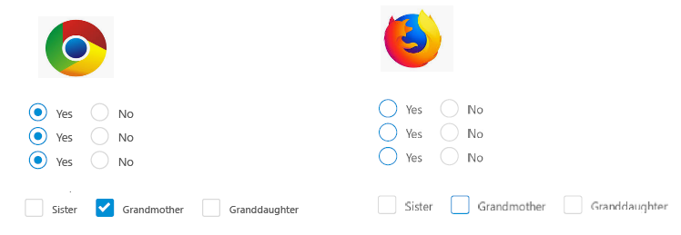

# Project related with react-to-print module

This project uses the pro.ant.design scaffolder. Its the same scaffolder that we are using in our in-production product.

# Issue #107
https://github.com/gregnb/react-to-print/issues/107 

Problem: The module tries to print a second blank page.

# Issue #115
https://github.com/gregnb/react-to-print/issues/115

I'm using the version '2.0.0-alpha.7' instead '2.1.0' cause I have the same bug found in issue #115

# Steps to reproduce the print problem

## Step 1
Install all the dependencies with 'yarn'

## Step 2
Starts the dev-server with 'yarn start'

## Step 3
By default, the server will opens the url  http://localhost:8000/dashboard/analysis.

* If don't, go there to load the test page

## Step 4
In the upper section will see a huge blue button with the text "Print test !!!", click on it to open the print dialog window.

# One more thing (another bug maybe?)

Another bug (?) that I found is about the radio and check buttons. In Google Chrome are printed good but in Firefox doesn't. I don't know if will be better to create another issue related with that or not.. 

# Thanks

;)
